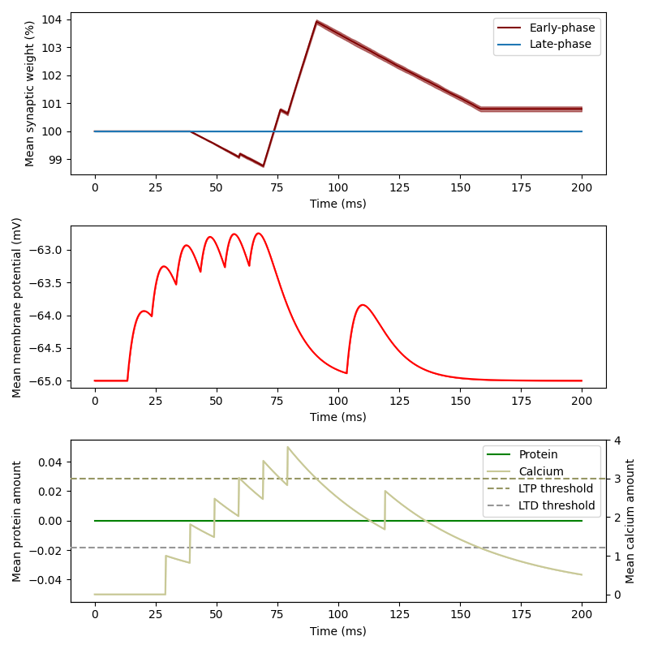
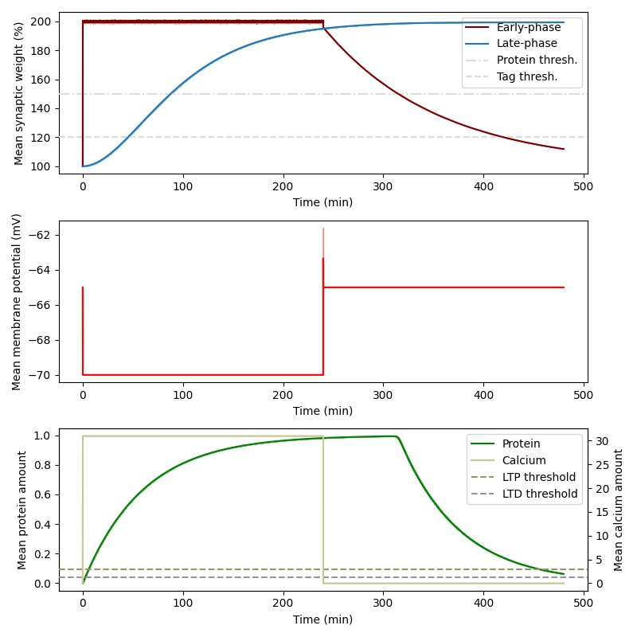

## Brian implementation of synaptic plasticity (calcium-induced, with synaptic tagging and capture) in neuronal networks 

This code implements a single current-based synapse which can undergo early-phase plasticity based on calcium dynamics and late-phase plasticity based on synaptic tagging and capture.

The early-phase dynamics are driven by neuronal spiking activity, and the late-phase dynamics depend on the early-phase through tag setting and protein synthesis (see [Luboeinski and Tetzlaff, 2021](https://doi.org/10.1038/s42003-021-01778-y), for details).

The simulation reproduces the outcome of a stand-alone simulator (see [this](https://github.com/jlubo/memory-consolidation-stc) repo) and of the Arbor simulator (see [this](https://github.com/jlubo/arbor_network_consolidation) repo).

### Usage

First of all, [Brian 2](https://briansimulator.org/) needs to be installed:
```
pip install brian2
```

To run the simulations and average over trials and batches, execute
```
python3 runBatchesBasic.py
```

To plot the results produced by the previous step, execute
```
python3 plot.py
```

Alternatively, you can run batches of early- or late-phase simulations, respectively, via
```
source run_batch_basic_early
source run_batch_basic_late
```

To run a single simulation of early- or late-phase dynamics, execute, respectively
```
source run_one_trial_early_phase
source run_one_trial_late_phase
```

For tests and to obtain the line coverage, [pytest](https://pytest.org/) and [coverage.py](https://coverage.readthedocs.io/) need to be installed:
```
pip install -U pytest pytest-cov coverage
```

To run tests and determine the test coverage for the main module, execute
```
source run_tests
```

### Results

#### Basic early-phase dynamics
Averaged over 10 batches with 100 trials each, the mean across batches is shown (computed from the mean across trials); error bands show the standard deviation across batches.



#### Basic late-phase dynamics
Averaged over 10 batches with 10 trials each, the mean across batches is shown (computed from the mean across trials); error bands show the standard deviation across batches.


